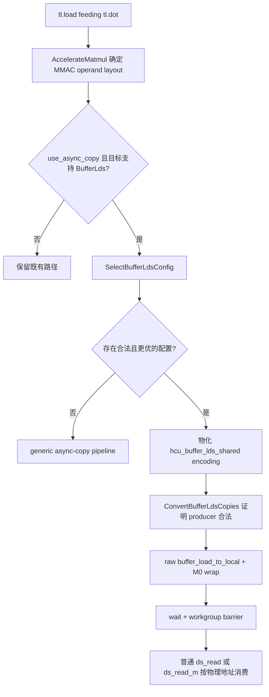

# HCU BufferLds：面向 LDS bank conflict 的异步拷贝

## 1. 功能概览

本功能在用户设置 `use_async_copy=True` 时，尝试把 GEMM 操作数原来的
“global buffer load 到 VGPR，再写入 LDS”转换为直接的
`buffer_load_* ... lds`。转换不只是替换一条指令：编译器还会根据 tile
形状、global 连续方向、wave 数、拷贝宽度和实际 LDS 消费指令，自动选择：

- 每个 producer wave 搬运哪些逻辑行；
- 连续搬多少行后切换到下一个 wave（row permutation）；
- 每个 wave 使用多少字节的 M0 circular wrap；
- consumer 如何把逻辑坐标还原成 wrap 后的物理 LDS 地址。

目标是在不改变 GEMM 语义和 LDS allocation 大小的前提下，降低实际消费阶段
的 LDS bank conflict。当前经过运行时覆盖的数据类型为 fp16、bf16 和 fp8。

这个功能：

- 继续使用已有的 `use_async_copy`，没有增加用户开关或 autotune 参数；
- 和 MLS（matrix-load-to-LDS）是两条独立路径；
- 和 block ping-pong 的调度优化相互独立；
- 不负责 buffer cache swizzle；cache descriptor 仍由公共 buffer-op 路径构造；
- 对 A、B 分别建模，不通过名字硬编码 A/B 策略。

## 2. 编译流程



选择 pass 在最终 dot-operand encoding 已知之后运行，因此 planner 看到的是实际
MMAC fragment，而不是猜测某个固定 A/B layout。选中后，producer 和 consumer
共享同一个 typed encoding：

```text
#ttg.hcu_buffer_lds_shared
    ├── tile geometry
    ├── row permutation
    ├── copy width
    ├── wrap count / wrap step
    ├── contiguous dimension
    └── physical LinearLayout
```

任何后续变换如果破坏这个合约，lowering 都会 fail closed，而不会让一个未 wrap
的 writer 去喂按 wrap 地址读取的 consumer。

## 3. 硬件模型

### 3.1 LDS 和 M0 target profile

| Target | LDS bank | LDS 容量 | 总线/phase | M0 LDS offset | M0 wrap field | wrap 粒度 |
| --- | ---: | ---: | ---: | --- | --- | ---: |
| gfx936 / BMZ | 32 × 4 B | 64 KiB | 128 B | `[15:0]` | `[20:16]`，线性 4-dword 单位 | 16 B |
| gfx938 / NMZ | 32 × 4 B | 64 KiB | 128 B | `[15:0]` | `[18:16]` 选 4-dword group，`[20:19]` 选 group 内 dword | 4 B |
| gfx92a / YY | 32 × 4 B | 64 KiB | 128 B | `[15:0]` | `[26:24]` 选 4-dword group，`[28:27]` 选 group 内 dword | 4 B |
| gfx946 / SB | 64 × 4 B | 128 KiB | 128 B | `[16:0]` | `[29:24]`，线性 dword 单位 | 4 B |

SB 虽然有 64 个物理 bank，但一次 hardware phase 仍只传输 128 B；cost model
不会错误地把它当成 256 B/phase。

planner 只处理“旋转多少字节”。M0 位域如何编码由 target profile 单独负责，避免
把 BMZ、NMZ、YY、SB 的编码细节扩散到通用搜索逻辑中。

### 3.2 LDS 读取模型

对于物理字节地址 `p`：

```text
bank(p) = floor(p / bankBytes) mod bankCount
```

cost model 按真实消费指令拆分 hardware phase，并统计每个 phase 内访问同一
bank 的不同 dword 数。同一个 dword 被多个 lane 读取按 broadcast 处理，不误算
成 conflict。

LDS access model 可以表达以下消费方式；具体 kernel 只会选择与其 MMAC
fragment、copy width 和目标证据同时匹配的子集：

| Consumer | 单 lane 读取 | phase 模型 |
| --- | ---: | --- |
| `ds_read_b16` | 2 B | wave64 连续 lane |
| `ds_read_b32` | 4 B | 每 phase 32 lanes |
| `ds_read_b64` | 8 B | 每 phase 16 lanes |
| `ds_read_b128` | 16 B | wave64 的目标专属交错 phase |
| `ds_read_m32x16_b16` | 16 B | 8 phases × 8 source lanes |
| `ds_read_m32x32_b8` | 16 B | 8 phases × 8 source lanes |

其他 matrix-read intrinsic 已被枚举，但只有具备目标验证的 source routing 和
phase 模型时才允许参与配置搜索；不能仅凭指令名字或矩阵尺寸推断。

## 4. 地址变换

### 4.1 Row permutation

假设 tile 有 `rows` 行、每行 `rowBytes`，使用 `waves` 个 producer waves。
`rowsPerChunk` 表示一个 wave 连续搬运多少行后切换到下一个 wave，
`wavesPerRowGroup` 表示多少个相邻 wave 组成一个 row group。

常见的全 wave 交错可写成：

```text
producerWave(row) = floor(row / rowsPerChunk) mod waves
```

例如 `rowsPerChunk=1, waves=8`：

```text
W0: row 0, 8
W1: row 1, 9
W2: row 2, 10
...
W7: row 7, 15
```

`wavesPerRowGroup` 允许搜索器把相邻 waves 限制在较小的行组内，以兼顾 global
sector locality。它改变的是逻辑行到 producer wave 的映射，不改变元素值。

### 4.2 Circular wrap

一条 `buffer_load_* ... lds` 由一个 wave 发射。单次传输大小是：

```text
wrapPeriodBytes = waveSize × copyBytesPerLane
```

producer wave `w` 的旋转量是：

```text
rotation(w) = (w mod wrapCount) × wrapStepBytes
```

对于未旋转的物理偏移 `u`：

```text
physical(u, w) = floor(u / period) × period
               + (u mod period + rotation(w)) mod period
```

这是传输内部的循环旋转，不增加 LDS 空间，也不是跨整个 tile 的 wrap。consumer
必须应用同一逆向映射，不能继续按线性 LDS 地址读取。

### 4.3 `transferMajor`

`transferMajor` 只描述 LDS allocation 中多个 transfer slice 的物理排列顺序：

- `false`：同一个 wave 的 transfers 连续；这是通用搜索产生的布局；
- `true`：先放所有 waves 的第 0 个 transfer，再放第 1 个 transfer。

它不改变 global 行分工，也不是 bank-conflict 搜索变量。只有需要独立消费
transfer slice 的调度才会显式转换为 `transferMajor=true`。

## 5. Excel 示例一：M=256、K=16、fp16

这个例子对应左操作数 K-contiguous tile。逻辑矩阵为 256×16，每个元素 2 B，
总共 8 KiB。8 个 waves 每个负责 1 KiB；每 lane 搬 16 B 时，一个 wave 正好
发射一条 1 KiB 的 buffer-to-LDS load。

### 5.1 Global 二维矩阵（M 为行，K 为列）

单元格使用线性元素 index `16 × M + K`：

| M \ K | 0 | 1 | 2 | 3 | … | 12 | 13 | 14 | 15 | producer |
| ---: | ---: | ---: | ---: | ---: | :---: | ---: | ---: | ---: | ---: | --- |
| 0 | 0 | 1 | 2 | 3 | … | 12 | 13 | 14 | 15 | W0 |
| 1 | 16 | 17 | 18 | 19 | … | 28 | 29 | 30 | 31 | W0 |
| 2 | 32 | 33 | 34 | 35 | … | 44 | 45 | 46 | 47 | W0 |
| 3 | 48 | 49 | 50 | 51 | … | 60 | 61 | 62 | 63 | W0 |
| 4 | 64 | 65 | 66 | 67 | … | 76 | 77 | 78 | 79 | W1 |
| 5 | 80 | 81 | 82 | 83 | … | 92 | 93 | 94 | 95 | W1 |
| 6 | 96 | 97 | 98 | 99 | … | 108 | 109 | 110 | 111 | W1 |
| 7 | 112 | 113 | 114 | 115 | … | 124 | 125 | 126 | 127 | W1 |
| … | … | … | … | … | … | … | … | … | … | … |
| 32 | 512 | 513 | 514 | 515 | … | 524 | 525 | 526 | 527 | W0 |
| 33 | 528 | 529 | 530 | 531 | … | 540 | 541 | 542 | 543 | W0 |
| … | … | … | … | … | … | … | … | … | … | … |
| 252 | 4032 | 4033 | 4034 | 4035 | … | 4044 | 4045 | 4046 | 4047 | W7 |
| 253 | 4048 | 4049 | 4050 | 4051 | … | 4060 | 4061 | 4062 | 4063 | W7 |
| 254 | 4064 | 4065 | 4066 | 4067 | … | 4076 | 4077 | 4078 | 4079 | W7 |
| 255 | 4080 | 4081 | 4082 | 4083 | … | 4092 | 4093 | 4094 | 4095 | W7 |

配置为 `rowsPerChunk=4` 时，W0…W7 依次搬 4 行，然后 W0 再搬下一组 4 行，
与 Excel 中的分工一致。

### 5.2 不使用 wrap：`ds_read_b64` 为 4-way

fp16 K=16，因此相邻 M 行相距 32 B，也就是 8 个 bank。`ds_read_b64` 的第一个
phase 由 T0…T15 读取，每个 lane 读取 8 B（两个 bank）。未旋转时只有 8 组
bank 被使用，每组承受四个请求：

| Bank | 0 | 1 | 2 | 3 | 4 | 5 | 6 | 7 | 8 | 9 | 10 | 11 | 12 | 13 | 14 | 15 | 16 | 17 | 18 | 19 | 20 | 21 | 22 | 23 | 24 | 25 | 26 | 27 | 28 | 29 | 30 | 31 |
| ---: | --- | --- | --- | --- | --- | --- | --- | --- | --- | --- | --- | --- | --- | --- | --- | --- | --- | --- | --- | --- | --- | --- | --- | --- | --- | --- | --- | --- | --- | --- | --- | --- |
| 请求 lane | T0/T4/T8/T12 | T0/T4/T8/T12 | – | – | – | – | – | – | T1/T5/T9/T13 | T1/T5/T9/T13 | – | – | – | – | – | – | T2/T6/T10/T14 | T2/T6/T10/T14 | – | – | – | – | – | – | T3/T7/T11/T15 | T3/T7/T11/T15 | – | – | – | – | – | – |

最大冲突为 4-way。

### 5.3 每个 wave 使用不同 wrap：降为 2-way

BMZ wrap 粒度为 16 B，也就是 4 个 bank。当前搜索结果为
`wrapCount=4, wrapStepBytes=16`：W0…W3 分别旋转 0、16、32、48 B，
W4…W7 重复这一周期。第一个 `ds_read_b64` phase 变成：

| Bank | 0 | 1 | 2 | 3 | 4 | 5 | 6 | 7 | 8 | 9 | 10 | 11 | 12 | 13 | 14 | 15 | 16 | 17 | 18 | 19 | 20 | 21 | 22 | 23 | 24 | 25 | 26 | 27 | 28 | 29 | 30 | 31 |
| ---: | --- | --- | --- | --- | --- | --- | --- | --- | --- | --- | --- | --- | --- | --- | --- | --- | --- | --- | --- | --- | --- | --- | --- | --- | --- | --- | --- | --- | --- | --- | --- | --- |
| 请求 lane | T0/T11 | T0/T11 | – | – | T4/T15 | T4/T15 | – | – | T1/T8 | T1/T8 | – | – | T5/T12 | T5/T12 | – | – | T2/T9 | T2/T9 | – | – | T6/T13 | T6/T13 | – | – | T3/T10 | T3/T10 | – | – | T7/T14 | T7/T14 | – | – |

32-bank 总线中仍有一半 bank 空闲，因为 `ds_read_b64` 每 lane 只跨 2 bank，而
BMZ 最小 wrap 是 4 bank；因此这个硬件约束下的最优结果是 2-way，而不是 1-way。

## 6. Excel 示例二：K=16、N=256、fp16

这个例子对应右操作数 N-contiguous tile，同样是 8 KiB。每个 wave 搬两行，
但不能让一个 wave 搬连续两行。Excel 使用的全 wave 交错示意是：

```text
W0: K row 0, 8       W4: K row 4, 12
W1: K row 1, 9       W5: K row 5, 13
W2: K row 2, 10      W6: K row 6, 14
W3: K row 3, 11      W7: K row 7, 15
```

也就是 `rowsPerChunk=1, wavesPerRowGroup=8`。这是一个合法的机制示例。

通用 planner 还会同时比较 global sector locality。当前代码对这个精确 tile 的
winner 是 `rowsPerChunk=1, wavesPerRowGroup=2`：

```text
W0: K row 0, 2       W4: K row 8, 10
W1: K row 1, 3       W5: K row 9, 11
W2: K row 4, 6       W6: K row 12, 14
W3: K row 5, 7       W7: K row 13, 15
```

两种分组都让相邻的偶/奇 K 行由具有不同 wrap 的 waves 搬运，因而下面第一组
matrix-read phase 的 32-bank 结果相同。文档同时列出两列 producer，避免把
Excel 示意配置误写成编译器唯一输出。

### 6.1 Global 二维矩阵（K 为行，N 为列）

单元格使用线性元素 index `256 × K + N`：

| K \ N | 0 | 1 | 2 | 3 | … | 252 | 253 | 254 | 255 | Excel producer | 当前 winner |
| ---: | ---: | ---: | ---: | ---: | :---: | ---: | ---: | ---: | ---: | --- | --- |
| 0 | 0 | 1 | 2 | 3 | … | 252 | 253 | 254 | 255 | W0 | W0 |
| 1 | 256 | 257 | 258 | 259 | … | 508 | 509 | 510 | 511 | W1 | W1 |
| 2 | 512 | 513 | 514 | 515 | … | 764 | 765 | 766 | 767 | W2 | W0 |
| 3 | 768 | 769 | 770 | 771 | … | 1020 | 1021 | 1022 | 1023 | W3 | W1 |
| 4 | 1024 | 1025 | 1026 | 1027 | … | 1276 | 1277 | 1278 | 1279 | W4 | W2 |
| 5 | 1280 | 1281 | 1282 | 1283 | … | 1532 | 1533 | 1534 | 1535 | W5 | W3 |
| 6 | 1536 | 1537 | 1538 | 1539 | … | 1788 | 1789 | 1790 | 1791 | W6 | W2 |
| 7 | 1792 | 1793 | 1794 | 1795 | … | 2044 | 2045 | 2046 | 2047 | W7 | W3 |
| 8 | 2048 | 2049 | 2050 | 2051 | … | 2300 | 2301 | 2302 | 2303 | W0 | W4 |
| 9 | 2304 | 2305 | 2306 | 2307 | … | 2556 | 2557 | 2558 | 2559 | W1 | W5 |
| 10 | 2560 | 2561 | 2562 | 2563 | … | 2812 | 2813 | 2814 | 2815 | W2 | W4 |
| 11 | 2816 | 2817 | 2818 | 2819 | … | 3068 | 3069 | 3070 | 3071 | W3 | W5 |
| 12 | 3072 | 3073 | 3074 | 3075 | … | 3324 | 3325 | 3326 | 3327 | W4 | W6 |
| 13 | 3328 | 3329 | 3330 | 3331 | … | 3580 | 3581 | 3582 | 3583 | W5 | W7 |
| 14 | 3584 | 3585 | 3586 | 3587 | … | 3836 | 3837 | 3838 | 3839 | W6 | W6 |
| 15 | 3840 | 3841 | 3842 | 3843 | … | 4092 | 4093 | 4094 | 4095 | W7 | W7 |

### 6.2 线性 LDS：matrix read 为 2-way

`ds_read_m32x16_b16` 每 lane 读取 8 个 fp16，即连续 16 B/4 banks。一个
hardware phase 的 source lanes 为：

```text
T0, T4, T1, T5, T18, T22, T19, T23
```

N=256 时，一行跨度为 512 B，正好是 32-bank 周期的整数倍。线性 LDS 下：

| Bank | 0 | 1 | 2 | 3 | 4 | 5 | 6 | 7 | 8 | 9 | 10 | 11 | 12 | 13 | 14 | 15 | 16 | 17 | 18 | 19 | 20 | 21 | 22 | 23 | 24 | 25 | 26 | 27 | 28 | 29 | 30 | 31 |
| ---: | --- | --- | --- | --- | --- | --- | --- | --- | --- | --- | --- | --- | --- | --- | --- | --- | --- | --- | --- | --- | --- | --- | --- | --- | --- | --- | --- | --- | --- | --- | --- | --- |
| 请求 lane | T0/T4 | T0/T4 | T0/T4 | T0/T4 | T1/T5 | T1/T5 | T1/T5 | T1/T5 | T18/T22 | T18/T22 | T18/T22 | T18/T22 | T19/T23 | T19/T23 | T19/T23 | T19/T23 | – | – | – | – | – | – | – | – | – | – | – | – | – | – | – | – |

八个 lanes 只覆盖 16 个 bank，所以是 2-way。

### 6.3 Row permutation + wrap：降为 1-way

当前 winner 让每个 wave 在自己的 2-row group 中交错搬运两行，并使用
`wrapCount=2, wrapStepBytes=64`：偶数 wave 不旋转，奇数 wave 旋转 64 B
（16 banks）。同一个 matrix-read phase 的物理 bank 变为：

| Bank | 0 | 1 | 2 | 3 | 4 | 5 | 6 | 7 | 8 | 9 | 10 | 11 | 12 | 13 | 14 | 15 | 16 | 17 | 18 | 19 | 20 | 21 | 22 | 23 | 24 | 25 | 26 | 27 | 28 | 29 | 30 | 31 |
| ---: | --- | --- | --- | --- | --- | --- | --- | --- | --- | --- | --- | --- | --- | --- | --- | --- | --- | --- | --- | --- | --- | --- | --- | --- | --- | --- | --- | --- | --- | --- | --- | --- |
| 请求 lane | T0 | T0 | T0 | T0 | T1 | T1 | T1 | T1 | T18 | T18 | T18 | T18 | T19 | T19 | T19 | T19 | T4 | T4 | T4 | T4 | T5 | T5 | T5 | T5 | T22 | T22 | T22 | T22 | T23 | T23 | T23 | T23 |

32 个 bank 每个只被请求一次，因此为 1-way。这里的关键是 row permutation 和
wrap 必须成对设计；只交错 global 行但不修改 consumer LDS 地址，或者只设置 M0
而仍按线性地址读取，都会得到错误结果或保留冲突。

## 7. 配置搜索与选择目标

搜索空间由硬件和 tile 推导，不包含特定 MNK hardcode：

- `copyBytesPerLane ∈ {4, 8, 16}`；
- `rowsPerChunk` 为合法的 2 次幂；
- `wavesPerRowGroup` 为不超过 producer waves 的 2 次幂；
- `wrapCount` 为合法的 2 次幂；
- `wrapStepBytes` 按 target wrap 粒度枚举；
- global row stride 来自真实 pointer layout。

每个候选必须先证明：

1. tile、wave、copy width 和 LDS 容量合法；
2. 每个 consumer lane 的读取范围在 wrap 后仍物理连续；
3. target 能编码最大 wrap；
4. producer pointer、mask、alignment 和 vector width 满足直接写 LDS 的要求。

候选按照以下优先级排序：

1. 最坏 LDS conflict way；
2. 所有 read phases 的总服务成本；
3. global 32-B sector 数；
4. buffer-load 指令数；
5. row chunk、row group 和 wrap 的确定性 locality tie-breaker。

因此 bank conflict 优先于 global coalescing，但在 conflict 相同的候选中仍会选择
global sector 更少的配置。

## 8. 支持范围和回退

BufferLds 当前要求：

- rank-2 MMAC dot operand；
- 单 CTA（`num_ctas == 1`）；
- 已启用 buffer ops；
- 未启用 WASP；
- tile 维度和硬件参数可以由当前 power-of-two LinearLayout 精确表达；
- copy width、mask、alignment 和 LDS 容量满足 producer 证明；
- consumer 是已建模的普通 LDS read 或 matrix read。

路由规则：

| 情况 | 行为 |
| --- | --- |
| `use_async_copy=False` | 完全不尝试 BufferLds，保留原路径 |
| target/buffer ops/WASP/shape 不满足入口条件 | 不物化 BufferLds encoding |
| 搜索不到合法配置 | 使用既有 generic async-copy pipeline |
| 找到配置且 producer 证明成立 | 使用 BufferLds row-permute + wrap |
| encoding 已物化，但后续 producer 不再满足合约 | 编译失败，禁止不安全的静默回退 |
| MLS operand | 保留 MLS 自己的 producer/consumer 路径 |

可以从编译 metadata 判断最终是否选中：

```python
compiled.metadata.uses_bank_conflict_aware_lds_placement
```

## 9. 代码结构

| 文件 | 职责 |
| --- | --- |
| `BufferLdsConfig.h` | Target profile、row/wrap 参数和逻辑/物理 byte 双向映射；不依赖 MLIR |
| `BufferLdsConfigSelection.h` | 枚举候选、计算 global sectors、调用 LDS conflict model 并排序 |
| `LdsReadModel.h` | 指令、phase、source/result routing 和 bank cost 的纯模型 |
| `LdsReadAccessPatterns.h` | 普通 LDS read 与已验证 matrix-read 的 lane/phase pattern |
| `BufferLdsEncoding.h/.cpp` | 在配置与 typed shared/producer encoding 之间转换 |
| `SelectBufferLdsConfig.cpp` | 识别 dot operands，选择配置并物化 shared encoding |
| `ConvertBufferLdsCopies.cpp` | 证明真实 producer，并转换为 buffer-to-LDS copy |
| `BufferLdsAddress.h/.cpp` | 生成 consumer 使用的 wrap 后物理 LDS byte address |
| `BufferLdsLocalLoadLowering.cpp` | 普通 local load 的目标专属物理寻址 |
| `BufferLdsM0.h` | 将 byte rotation 编码到各 target 的 M0 位域 |

## 10. 验证

全部新增 pytest 已加入 `third_party/hcu/test/regression.sh`：

```sh
# 纯 C++ 配置搜索、读指令和 bank cost 模型
pytest third_party/hcu/test/test_buffer_lds_config.py

# BufferLds GEMM、dispatch、fallback、fp16/bf16
HIP_VISIBLE_DEVICES=<idle-gpu> \
  pytest third_party/hcu/test/test_buffer_lds_copy.py

# fp16/fp8 搬运、物理 readback、NMZ split-wrap 和 matrix-read consumer
HIP_VISIBLE_DEVICES=<idle-gpu> \
  pytest third_party/hcu/test/test_async_copy_dtypes.py
```

此外，probe 工具用于采集 target-specific 指令证据：

- `run_lds_bank_probe.py`：普通/read2/matrix read 的 LDS counter；
- `probe_lds_phase_pairs.py`：通过 pair collision 推导 phase lane group；
- `run_lds_instruction_probe.py`：编译指令并验证 source-to-result routing。

probe 结果只是目标证据，不会自动授权一个新 target 或未建模 matrix-read 变体。

本 MR 提交时的运行时验收状态为：

| Target | 验收状态 |
| --- | --- |
| gfx936 / BMZ | 已运行 BufferLds、普通 LDS read、matrix read、fp16/bf16/fp8 覆盖 |
| gfx938 / NMZ | 已运行 split-wrap 物理 readback、fp16/bf16 GEMM 和 fp8 matrix-read 覆盖 |
| gfx92a / YY | 已覆盖 target codec 和纯模型；仍需在对应硬件执行 runtime regression |
| gfx946 / SB | 已覆盖 target codec、128-KiB/64-bank 模型和 guarded runtime 用例；仍需在对应硬件执行完整 regression |
